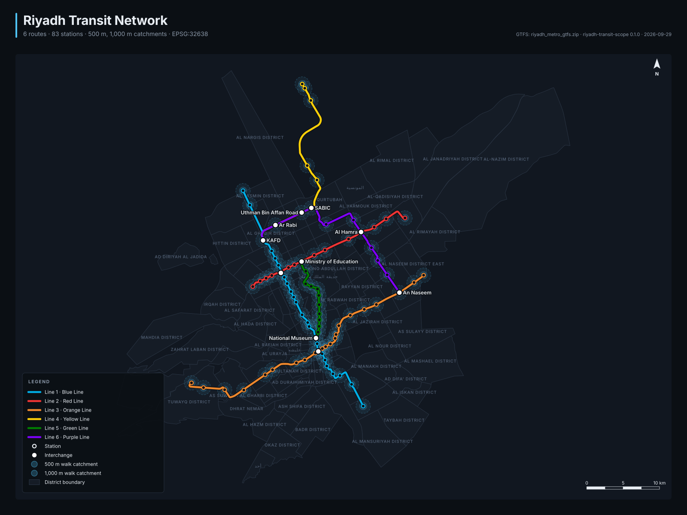

# riyadh-transit-scope

A terminal toolkit for researching Riyadh's public transport, built around one `transit` command. It ships with a **validated Riyadh Metro dataset**:
- Real station positions, alignments and Arabic names come from OpenStreetMap.
- Station names and counts come from the official per-line lists.
- The whole dataset is checked against RCRC's published figures and an independent length survey.

| Module | What it does |
|---|---|
| **Riyadh data** (`transit_scope/riyadh/`) | Builds a GTFS feed and map layers from OSM snapshots and the official reference, then validates them |
| **GTFS engine** (`transit_scope/gtfs/`) | Computes network KPIs: route-km, headways, station activity, walk catchments and transfer friction |
| **Microclimate** (`transit_scope/microclimate/`) | Models walkability to a station in extreme heat and scores it with the Effective Walkable Catchment Score (EWCS) |
| **Maps** (`transit_scope/gis_svg/`, `html_report.py`) | Produces a static SVG map and a single-file HTML report with a fully interactive map |



## The data, and how far to trust it

| Part | Source | Status |
|---|---|---|
| Line alignments, station positions, station codes, Arabic names | OpenStreetMap route relations and station features (snapshot bundled, ODbL) | Real, validated |
| Station names, order and per-line counts | Official per-line lists (Wikipedia line articles, which cite RCRC) | Real |
| Network totals (176 km, 85 stations), operating hours, 3–7 min headway range | RCRC statements reported by SPA and news outlets | Real |
| Per-line headways and running speed | Modelled within the published range (RCRC publishes no timetable or GTFS) | **Assumption, labelled** |
| Neighbourhood boundaries | OSM admin level 10 (146 of them); broken rings repaired only across gaps under 500 m | Real, with gaps |
| Riyadh Bus | OSM maps 7 of the 80 official routes and 548 of 2,860 stops | **Partial**, shown as a map layer only |

**Why OSM plus published figures?** No official GTFS feed is published: none appears in the Mobility Database catalogue. The RCRC and Riyadh Metro websites also block automated access.

### Validation

`transit validate` rebuilds the dataset from the snapshots and runs about 135 checks. A build is accepted only with **zero mismatches and zero errors**. The current bundled build passes: 125 pass · 3 resolved · 7 notes · 0 mismatches · 0 errors.

**What is checked:**
- **Station counts.** Each line has exactly its official number of stations: 25 / 15 / 22 / 9 / 12 / 11.
- **Station identity.** Every station's name and order match the official list, and 81 of 83 are confirmed by a separately mapped OSM station feature within 250 m.
- **Line lengths.**
  - Against UrbanRail.net's independent survey: within 0.6% on every line.
  - Against the official route lengths: 2–4% shorter. That is expected, because the official figures include tail track beyond the end stations.
- **Interchanges.** The 10 interchanges and the lines they join match the official lists, with platforms 0–94 m apart.
- **Timetable.** Headways fall within the published 3–7 minute range, and the first departure is at 05:30.
- **Integrity.** The GTFS loads cleanly, shape lengths equal the OSM alignments, speeds are plausible, Arabic names are genuinely Arabic script, and the build is deterministic.

**Documented notes, not hidden:**
- **Station total, 83 vs 85.** RCRC's headline figure is 85 stations. The official per-line lists (94 entries, minus shared interchange stations) give 83, and no published source reconciles the two.
- **Two station names differ between sources.** OSM calls them "King Fahad Stadium" and "PNU 2"; the official lists say "King Fahd Sports City" and "Governmental Complex". The official names are used, and the OSM names are kept as aliases.
- **Airport and campus stations.** Five stations serving the airport and Princess Nourah University lie outside any municipal district. They are placed in the airport or campus polygon instead.

---

## Installation

You need Python 3.11 or newer.

```bash
cd riyadh-transit-scope
python -m venv .venv && source .venv/bin/activate
pip install -e ".[dev]"      # installs the `transit` command
```

Dependencies: `typer`, `rich`, `pandas`, `geopandas`, `shapely`, `pyproj`, `pydantic`.

## Quick start

```bash
transit validate                                   # check the bundled data against official figures
transit report-html                                # single-file report with the interactive map
transit analyze                                    # network KPIs for the six metro lines
transit simulate-corridor --temp 44 --shade 35 --distance 800
transit export-svg --out map.svg --theme dark      # static print map
transit build-riyadh                               # rebuild the data from the OSM snapshots
transit fetch-osm                                  # refresh the snapshots from Overpass (network)
transit sample-data ./data                         # copy the data files out for other tools
```

---

## Commands

### `transit report-html`

Writes one self-contained HTML file (about 220 KB). Only the fonts are fetched from the web, with fallbacks, so the file also opens offline.

**The interactive map** is plain JavaScript over SVG, with no map library or tile server:
- **Navigate.** Drag to pan, and zoom with the mouse wheel, a pinch, double-click, the buttons or the keyboard (arrow keys, `+` / `-`, `0` to fit, `Esc` to clear).
- **Stations.** Hover for a tooltip. Click for English and Arabic names, station codes, the neighbourhood, departures per day, combined peak headway and transfer friction. The panel also gives the heat-adjusted walk distance.
- **Lines.** Hover to highlight a line. Click to compare its official, independent and mapped lengths and to see its station list; each station in the list is clickable.
- **Neighbourhoods.** Click for area, the metro stations inside, and the share of the neighbourhood within 800 m of a station. A **coverage choropleth** colours every neighbourhood by that share.
- **Controls.**
  - line toggles
  - search across stations and neighbourhoods, in English or Arabic
  - a walk-catchment radius slider from 250 to 1,500 m
  - **heat-adjusted catchments**, which shrink with the heat-walk simulator's temperature and shade settings on the same page
  - the partial OSM bus routes and stops
  - label toggles
- **Everything else in the report:** the validation results, network tables with links back to the map, the heat-walk simulator, and all sources.

Options include `--gtfs` and `--geojson` for other data, `--temp` / `--shade` / `--distance` for the starting heat scenario, and `--fragment` to embed the report in another page.

### `transit validate [--all] [--json out.json]`

Prints the validation findings, with `--all` including passes. It exits with status 1 if any mismatch or error remains, so it can gate CI.

### `transit build-riyadh` and `transit fetch-osm`

- **`fetch-osm`** downloads fresh OSM snapshots through Overpass, trying several mirrors: the metro relations and stops, station features, neighbourhood and municipality boundaries, airport and campus areas, and bus routes and stops.
- **`build-riyadh`** reconciles the snapshots with `transit_scope/data/riyadh_reference.json`. It then writes these files into `transit_scope/data/`, validates them, and refuses the build (exit code 1) if anything mismatches:
  - `riyadh_metro_gtfs.zip`: parent stations plus one platform per line, `translations.txt` with Arabic names, shapes, and a timetable from the service plan
  - `riyadh_stations.geojson`
  - `riyadh_districts.geojson`
  - `riyadh_bus_osm.geojson`
  - `riyadh_validation.json`

To update the official figures or the service plan, edit the reference JSON. It is checked by a Pydantic schema, for example that each station list matches its line's station count and that every interchange appears in its lines' lists.

### `transit analyze [GTFS_PATH]`

Prints the network KPIs and writes a JSON report. It works on the bundled feed or on any GTFS file. The loader handles:
- zips with the files in a sub-folder, and files with a byte-order mark
- `frequencies.txt`, and feeds that use only `calendar_dates.txt`
- times after midnight, and stops with no times
- missing shapes, parent stations, and invalid route colours

Options: `--out`, `--peaks` (default `06:30-09:00,15:30-19:00`), `--radii`, `--crs` (automatic UTM, EPSG:32638 for Riyadh), `--date`, `--cluster-radius`, `--top`, and `--catchments-geojson`.

### `transit simulate-corridor`

Runs the heat-penalised walking model for one access corridor. It reports the EWCS and its grade, nominal, heat-adjusted and perceived walk times, the effective catchment radius and the catchment area lost, the heat dose, the shade needed to reach a target score, and a temperature × shade sensitivity grid.

### `transit export-svg`

Writes a static, print-quality SVG in a dark or light theme. It includes a legend, scale bar, north arrow, catchments, and labels that avoid overlapping each other.

---

## Methodology

- **Headway** is the average gap between consecutive departures on a route in one direction, split into peak and off-peak by the time of the earlier departure. The Riyadh peak windows are 06:30–09:00 and 15:30–19:00.
- **Transfer Friction Index:**

  `TFI = pairs × expected_wait × (1 + spread_m/200) × (1 + 0.25·(modes − 1))`

  The **hub score** (0–100) is `routes × √(peak departures)`, scaled so the busiest node is 100.
- **District coverage** is the share of each neighbourhood's area within 800 m of a station, measured in UTM 38N.
- **The EWCS heat model:**
  1. Radiant load in sun or shade adjusts a feels-like temperature (the corridor thermal index).
  2. Walking pace drops by 0.8% for every °C above 32.
  3. Above 40 °C, each unshaded metre is weighted by `1 + (T−40)(0.12·G/1000 + 0.04·km unshaded)`.
  4. `EWCS = 100 × nominal ÷ perceived walk time`.

  This is a screening model for comparing designs, not a substitute for UTCI or PET simulation.

## Project layout

```
riyadh-transit-scope/
├── transit_scope/
│   ├── cli.py                 # `transit …`
│   ├── html_report.py         # single-file report + interactive map
│   ├── riyadh/                # osm.py (snapshots, parsing, ring repair) · reference.py · build.py · validate.py
│   ├── gtfs/                  # loader, service-day selection, KPIs
│   ├── microclimate/          # EWCS model
│   ├── gis_svg/               # static SVG renderer
│   └── data/                  # osm/*.json.gz snapshots, riyadh_reference.json, built GTFS + GeoJSON, validation
├── docs/                      # example maps and HTML report
└── tests/                     # unit, pipeline, CLI and browser (Playwright) tests
```

## Development

```bash
pytest          # 77 tests; the browser tests skip unless Playwright + Chromium are available
ruff check .
transit build-riyadh && transit validate
```

The build is deterministic: rebuilding from the same snapshots gives byte-identical files, and a test enforces it.

## Sources and licences

- **Geometry, names and boundaries:** © OpenStreetMap contributors, [ODbL 1.0](https://www.openstreetmap.org/copyright). OSM snapshot taken 2026-09-29.
- **Official figures:** RCRC statements via SPA ([Gulf News](https://gulfnews.com/world/gulf/saudi/saudi-arabia-riyadh-metro-adjusts-schedule-to-530am-in-push-to-ease-traffic-1.500259210), [Gulf Business](https://gulfbusiness.com/en/2024/saudi-arabia/riyadh-metro-5-ways-boost-transport)), and the [Riyadh Metro](https://en.wikipedia.org/wiki/Riyadh_Metro) and [Line 1–6](https://en.wikipedia.org/wiki/Line_1_(Riyadh_Metro)) articles.
- **Independent line lengths:** [UrbanRail.net](https://urbanrail.net/as/riyadh/riyadh.htm).
- **Operating hours:** [Platinumlist guide](https://platinumlist.net/guide/riyadh-metro-changes-operating-hours-on-fridays-starting-july-4/).
